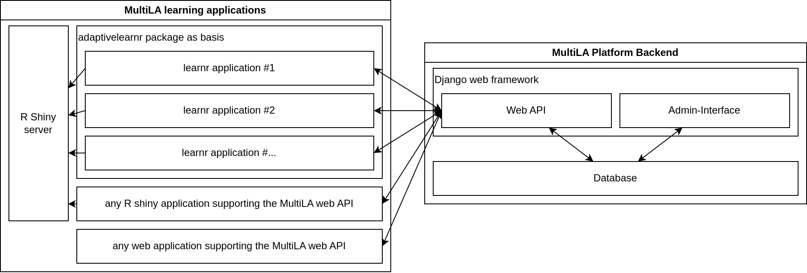

.. _components:

Software components
===================

Overview
--------

The following image show an overview of the MultiLA platform components:

- the web API is central and provides a common platform for setting up client applications, configuring and sharing
  them, and tracking user data and feedback
- all data – user generated or operational – is stored in the database

  - only the web API service has direct access to the database – client applications cannot access the database directly

- for *learnr* based client applications, there is a package *adaptivelearnr* that provides all necessary (JavaScript)
  code to interact with the web API and to make client applications *configurable*

  - this allows to quickly create several client applications that share the same code for interfacing with the web API
    and that can be configured in some details (e.g. including/excluding certain sections, aesthetic changes, etc.)

- the R Shiny server doesn't communicate with the MultiLA web API, only the JavaScript code on the client side
  implements the communication
- in general, any (web) application can use the MultiLA web API, which means for example R Shiny applications or
  Jupyter Notebook applications
- it may be possible to connect external services for authentication (e.g. Moodle)
